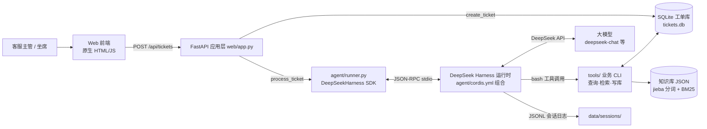

# 🎫 Ticket Agent — 智能客服工单处理 Agent

[](https://www.python.org/)
[](https://fastapi.tiangolo.com/)
[](https://github.com/deepseek-ai/deepseek-harness)
[](LICENSE)

> 基于 **DeepSeek Harness** 编排的客服工单处理 Agent：自动完成工单分类、优先级评估、知识库检索、建议答复生成，并把结论写回工单库。业务工具通过「工具调用」执行，全过程留有 JSONL 审计日志。

---

## 📌 项目背景与解决痛点

中小团队（电商、SaaS、本地服务商）的客服工单处理普遍存在三个问题：

| 痛点 | 现状 | 本项目方案 |
|---|---|---|
| 分类分派靠人工 | 客服主管逐条看工单、手动分类派单，晚班/节假日无人值守 | Agent 秒级完成分类、优先级评估与建议分派组 |
| 重复问题重复答 | 80% 的工单是 FAQ 覆盖过的重复问题 | Agent 检索知识库并基于条目**改写生成**建议答复，坐席一键采用 |
| 处理过程无沉淀 | 谁处理的、为什么这样分，无记录可查 | 每条工单的 Agent 决策理由 + 工具调用链全部落库、落日志，可审计可复盘 |

**业务价值**：把客服主管从重复劳动中解放出来，工单处理从“人肉流水线”变成“Agent 初筛 + 人工复核”。

## 🏗️ 总体架构



## 🧠 核心 Agent 设计

### 1. 编排方式：DeepSeek Harness Python SDK

- 使用官方 [`deepseek-harness-sdk`](https://github.com/deepseek-ai/deepseek-harness/blob/master/docs/user/guide/python-sdk.md)（模块 `deepseek_harness`），`DeepSeekHarness` 实例常驻复用，每条工单一个独立 `session_id`；
- 项目自带运行时组合 `agent/cordis.yml`（基于官方 `minimal.cordis.yml` 改造，仅改 persona 与模型 id 两处），关键插件职责：

| 插件 | 职责 |
|---|---|
| `dsh-sdk-jsonrpc-server` | SDK 与运行时的 JSON-RPC 通信通道 |
| `dsh-llm-deepseek` | DeepSeek 大模型适配器（凭据/端点走环境变量） |
| `dsh-agent-spine-demo` | Agent 主干，`persona` 注入客服工单 SOP |
| `dsh-tool-bash-persistent` | **持久 bash 工具**：Agent 执行业务 CLI 的通道 |
| `dsh-session-persistence-jsonl` | 会话 JSONL 持久化：模型往返与工具调用全审计 |

### 2. Agent 工作流（SOP 写入系统提示词）

```text
收到工单 → ① 查上下文（ticket_query） → ② 检索知识库（kb_search，至少一次）
        → ③ 综合判断：分类 / 优先级 1-10 / 建议分派组 / 是否升级
        → ④ 结论写回工单库（ticket_update，答复必须引用知识库条目 id）
        → ⑤ 输出 JSON 结论
```

### 3. 工具调用（3 个业务工具，均输出单行 JSON）

| 工具 | 能力 | 安全设计 |
|---|---|---|
| `tools/ticket_query.py` | 按 id / 状态 / 关键字查工单 | 只读 |
| `tools/kb_search.py` | 知识库 BM25 检索（jieba 分词） | 只读，返回条目 id 供引用 |
| `tools/ticket_update.py` | 写回分类/优先级/分派组/建议答复/理由 | 字段白名单 + 取值校验，Agent 不能越权改库 |

### 4. 防幻觉与可信设计

- **先查后答**：SOP 强制先检索知识库，答复必须基于条目改写并引用条目 id；
- **不编造**：知识库未覆盖的内容，Agent 必须回答“建议转人工确认”，而不是编造政策；
- **以数据库为准**：Agent 的最终结论只有成功写回 SQLite 才算数，前端展示的权威数据来自工单库而非模型文本；
- **全程可审计**：每次任务的工具调用链落在 `data/sessions/<session_id>.jsonl`。

## 📦 功能模块

1. **工单提交与自动处理**：网页提交 → Agent 自动分类/评估/答复（30s～2min 内返回）；
2. **知识库检索**：中文分词 + BM25 全文检索，结果带相关度得分，可解释；
3. **工单管理**：工单列表实时展示 Agent 处理结果（分类、优先级、分派组、状态）；
4. **离线工具演示**：`demo_tools.py` 不调大模型即可跑通全部工具链；
5. **会话审计**：JSONL 日志完整记录模型往返与工具调用，便于复盘 Prompt 效果。

## 🛠️ 技术栈

| 层 | 技术 |
|---|---|
| Agent 编排 | DeepSeek Harness（Python SDK + Cordis 运行时组合） |
| 大模型 | DeepSeek API（`deepseek-chat` 等，端点/模型可配） |
| 业务工具 | Python 3.10+ CLI（argparse，输出 JSON） |
| Web | FastAPI + Uvicorn + 原生 HTML/JS（零前端框架） |
| 数据 | SQLite（工单库）+ JSON 知识库 + jieba/BM25 检索 |

## 🚀 快速开始

### 0. 平台与前置要求

- **Python 3.10+**
- **操作系统**：DeepSeek Harness Python SDK 官方运行时 wheel 支持 **Linux x64/arm64、macOS 14+ arm64**。Windows 用户请在 **WSL2** 中运行（FastAPI 与业务工具本身跨平台，仅 Harness 运行时受平台 wheel 限制）。
- **DeepSeek API Key**：在 [platform.deepseek.com](https://platform.deepseek.com) 申请。

### 1. 安装 DeepSeek Harness Python SDK（二选一）

```bash
# 方式 A：官方发布版（官方文档路径）
pip install deepseek-harness-sdk
# SDK 会自动安装同版本的运行时（deepseek-harness-runtime-bin）

# 方式 B：官方源码构建（当 PyPI 尚无对应平台 wheel，或想自定义运行时组合时）
git clone https://github.com/deepseek-ai/deepseek-harness.git
cd deepseek-harness
pnpm install
pnpm exec tsx scripts/build-exe-for-python-sdk.ts   # 构建单文件运行时（写入 dist-exe/ 并同步到 python/sdk-runtime/）
# 回到本项目，用 uv 以 editable 方式安装 SDK（官方 uv.sources 自动关联本地 runtime-bin）：
uv pip install -e /path/to/deepseek-harness/python/sdk
```

> SDK 用法以上游官方文档为准：<https://github.com/deepseek-ai/deepseek-harness/blob/master/docs/user/guide/python-sdk.md>

### 2. 安装业务依赖并配置密钥

```bash
pip install -r requirements.txt
# 国内网络较慢时可加镜像源：
# pip install -r requirements.txt -i https://pypi.tuna.tsinghua.edu.cn/simple
cp .env.example .env        # 编辑 .env，填入 DEEPSEEK_API_KEY=sk-xxxx
python tools/seed_demo.py   # 初始化示例知识库与工单
```

### 3. 启动

```bash
python run.py               # 打开 http://127.0.0.1:8000
```

没有 API Key 也可以先验证工具链：

```bash
python demo_tools.py        # 离线演示：建库 → 查工单 → 知识库检索
```

## 📡 API 一览

| 方法 | 路径 | 说明 |
|---|---|---|
| GET | `/` | 演示页面 |
| POST | `/api/tickets` | 新建工单并交给 Agent 处理（同步返回结果） |
| GET | `/api/tickets?limit=50` | 工单列表 |
| GET | `/api/tickets/{id}` | 工单详情 |
| GET | `/api/health` | 健康检查 |

命令行示例：

```bash
curl -X POST http://127.0.0.1:8000/api/tickets \
  -H "Content-Type: application/json" \
  -d '{"title":"付款成功但订单显示未支付","description":"银行卡已扣款，订单页面一直显示待支付，请尽快核实。"}'
```

## 📁 目录结构

```text
project1-ticket-agent/
├── run.py                  # 一键启动 Web 服务
├── demo_tools.py           # 离线工具链演示（无需 API Key）
├── config.py               # 全局配置（.env 加载、路径、业务阈值）
├── requirements.txt
├── .env.example
├── agent/                  # Agent 编排层
│   ├── cordis.yml          # DeepSeek Harness 运行时组合（改自官方示例）
│   ├── prompts.py          # 客服工单 SOP（系统提示词）+ 任务模板
│   └── runner.py           # DeepSeekHarness SDK 封装（会话管理、结果解析）
├── tools/                  # 业务工具层（Agent 的“手”）
│   ├── ticket_db.py        # SQLite 工单库封装（白名单更新）
│   ├── kb.py               # 知识库加载 + BM25 检索
│   ├── ticket_query.py     # CLI：查工单
│   ├── kb_search.py        # CLI：知识库检索
│   ├── ticket_update.py    # CLI：更新工单
│   └── seed_demo.py        # 初始化示例数据
├── web/                    # 展示层
│   ├── app.py              # FastAPI 路由 + Agent 调度
│   └── static/index.html   # 原生 JS 前端
└── data/                   # 运行时数据（db/json/sessions，已被 gitignore）
```

## ✨ 项目亮点

1. **真实业务闭环**：不是“聊天 demo”，Agent 的产出落到工单库、有状态流转、可被人工复核；
2. **架构分层清晰**：编排层（Harness）/ 业务工具层（CLI）/ 数据层 / 展示层各司其职，工具可独立测试；
3. **可审计可信任**：JSONL 会话日志 + 决策理由落库，Prompt 效果可复盘、可调优；
4. **防幻觉设计**：先查后答、答复引用知识库条目、无依据即建议转人工；
5. **渐进式体验**：`demo_tools.py` 零密钥跑通工具链 → 配密钥跑完整 Agent，上手门槛低；
6. **依赖克制**：检索用 BM25 而非向量库（百级知识库足够、零外部服务），技术选型与业务规模匹配。

## 🗺️ Roadmap

- [ ] 工单批量处理与定时巡检（夜间积压自动消化）
- [ ] 知识库扩充工作流（Agent 从历史工单中提炼新 FAQ，人工审核入库）
- [ ] 检索升级为向量检索（知识库到万级时平滑替换，接口不变）
- [ ] 多轮追问：Agent 向用户补充提问后再给出结论

## ❓ 常见问题

**Q：为什么 Agent 通过 bash 调用 CLI，而不是函数调用？**
A：DeepSeek Harness SDK 的默认运行时组合以持久 bash 作为模型面向的工具；把业务能力封装成带 JSON 输出的 CLI 后，Agent 通过 bash 调用，每次工具调用都会完整记录在 JSONL 会话日志中。模型负责“决策”，工具负责“执行”，职责边界清晰，也便于单独测试工具。

**Q：可以换成其他模型吗？**
A：可以。改 `.env` 的 `DSH_MODEL`（如 `deepseek-reasoner`、`deepseek-v4-flash`）；使用 OpenAI 兼容代理时再设置 `DEEPSEEK_BASE_URL`。

**Q：知识库怎么扩充？**
A：直接编辑 `tools/seed_demo.py` 中的 `DEFAULT_KB`（重新执行 seed），或手工维护 `data/knowledge_base.json`。条目格式：`{id, category, question, answer, tags}`。

**Q：Agent 处理失败了怎么办？**
A：工单仍在库中。查看 `data/sessions/<session_id>.jsonl` 定位失败步骤（常见原因：密钥无效、网络不通、工具报错），修复后重新提交即可。

## ⚠️ 免责声明

本项目为学习与技术展示用途。Agent 生成的分类与建议答复仅作参考，涉及资金、账号安全等敏感工单请务必人工复核。项目按 [MIT License](LICENSE) 开源。

---

*作者：韦志杰（AI Agent 应用开发方向） · 求职作品集项目 1/2*
